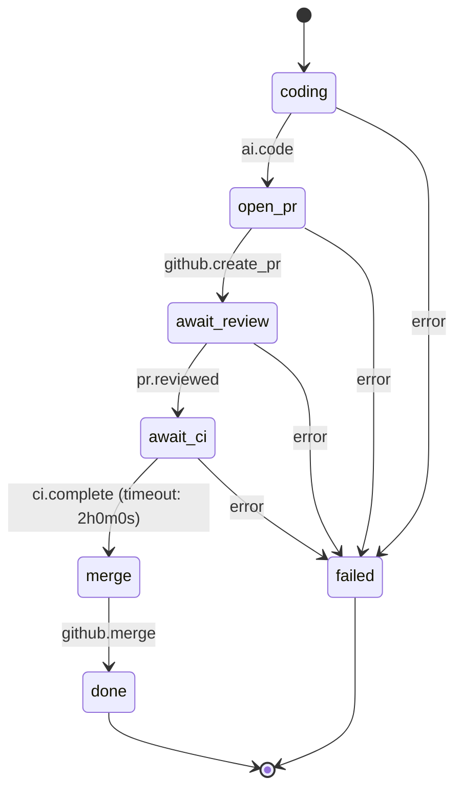

# Plural Agent

**Configurable autonomous agent that turns issues into merged PRs** — with containerized Claude Code sessions, workflow orchestration, and multi-provider support.

Plural Agent polls for work from GitHub, Asana, or Linear, spins up containerized Claude Code sessions, and manages the full lifecycle: coding, PR creation, review feedback, CI, and merge. The workflow is a configurable state machine — customize the pipeline per-repo or use sensible defaults.

## Install

```bash
brew tap zhubert/tap
brew install plural-agent
```

Or [build from source](#build-from-source).

## Requirements

- [Claude Code CLI](https://claude.ai/code) installed and authenticated
- Git
- GitHub CLI (`gh`)
- A container runtime: [Docker Desktop](https://docs.docker.com/get-docker/) or [Colima](https://github.com/abiosoft/colima)

## Quick Start

```bash
plural-agent agent --repo owner/repo
```

Label a GitHub issue `queued` and plural-agent picks it up automatically. For Asana or Linear, configure the [workflow source](#workflow-configuration).

---

## How It Works

1. Agent polls for issues from your configured provider (GitHub labels, Asana projects, or Linear teams)
2. Creates a containerized Claude Code session on a new branch
3. Claude works the issue autonomously
4. A PR is created when coding is complete
5. Agent addresses review feedback, waits for CI, and merges

For complex issues, Claude can delegate subtasks to child sessions via MCP tools (`create_child_session`, `list_child_sessions`, `merge_child_to_parent`). The supervisor waits for all children before creating a PR.

## CLI Reference

```bash
# Agent daemon
plural-agent --repo owner/repo        # Required: repo to poll
plural-agent --repo owner/repo --once # Single tick, then exit

# Workflow management
plural-agent workflow init                    # Generate .plural/workflow.yaml template
plural-agent workflow init --repo /path/to/repo
plural-agent workflow validate                # Validate workflow configuration
plural-agent workflow validate --repo /path/to/repo
plural-agent workflow visualize               # Print mermaid diagram of workflow

# Cleanup
plural-agent clean                    # Remove daemon state and lock files
plural-agent clean -y                 # Clean without confirmation

# General
plural-agent --version                # Show version
plural-agent --debug                  # Debug logging (default: on)
plural-agent -q / --quiet             # Info-level logging only
```

If `--repo` is not specified and the current directory is inside a git repository, that repository is used as the default.

Behavior (max turns, duration, merge method, auto-merge, etc.) is configured via `.plural/workflow.yaml` — see [Workflow Configuration](#workflow-configuration) below.

## Workflow Configuration

Create `.plural/workflow.yaml` in your repo to customize the agent's behavior per-repository. The workflow is defined as a **state machine** — a directed graph of states connected by `next` (success) and `error` (failure) edges. If no file exists, the agent uses sensible defaults.

```yaml
workflow: issue-to-merge
start: coding

source:
  provider: github          # github | asana | linear
  filter:
    label: queued            # github: issue label to poll

states:
  coding:
    type: task
    action: ai.code
    params:
      max_turns: 50
      max_duration: 30m
      containerized: true
      supervisor: true
    next: open_pr
    error: failed

  open_pr:
    type: task
    action: github.create_pr
    params:
      link_issue: true
    next: await_review
    error: failed

  await_review:
    type: wait
    event: pr.reviewed
    params:
      auto_address: true
      max_feedback_rounds: 3
    next: await_ci
    error: failed

  await_ci:
    type: wait
    event: ci.complete
    timeout: 2h
    params:
      on_failure: retry      # retry | abandon | notify
    next: merge
    error: failed

  merge:
    type: task
    action: github.merge
    params:
      method: rebase         # rebase | squash | merge
      cleanup: true
    next: done

  done:
    type: succeed

  failed:
    type: fail
```

### State types

| Type | Purpose | Required fields |
|------|---------|-----------------|
| `task` | Executes an action | `action`, `next` |
| `wait` | Polls for an external event, with optional timeout enforcement | `event`, `next` |
| `choice` | Conditional branch based on step data | `choices` |
| `pass` | Inject data and transition immediately | `next` |
| `succeed` | Terminal success state | -- |
| `fail` | Terminal failure state | -- |

### Actions

Actions are synchronous or asynchronous operations that a `task` state executes.

#### `ai.code`

Spawns a containerized Claude Code session to work the issue. This is the only **async** action -- the daemon starts a worker goroutine and polls for completion.

| Param | Type | Default | Description |
|-------|------|---------|-------------|
| `max_turns` | int | `50` | Max autonomous conversation turns |
| `max_duration` | duration | `30m` | Max wall-clock time for the session |
| `containerized` | bool | `true` | Run Claude inside a Docker container |
| `supervisor` | bool | `true` | Enable supervisor mode (can spawn child sessions via MCP) |
| `system_prompt` | string | `""` | Custom system prompt, inline or `file:.plural/prompts/coding.md` |

#### `github.create_pr`

Opens a pull request for the work item's branch.

| Param | Type | Default | Description |
|-------|------|---------|-------------|
| `link_issue` | bool | `true` | Link the PR back to the source issue |

#### `github.push`

Pushes the current branch to the remote. No configurable params. Used internally during the review feedback loop and available for custom workflows.

#### `github.merge`

Merges the PR and optionally cleans up the branch/worktree.

| Param | Type | Default | Description |
|-------|------|---------|-------------|
| `method` | string | `rebase` | Merge strategy: `rebase`, `squash`, or `merge` |
| `cleanup` | bool | `true` | Delete branch and worktree after merge |

#### `github.comment_issue`

Posts a comment on the source issue. No-op for non-GitHub issues.

| Param | Type | Default | Description |
|-------|------|---------|-------------|
| `body` | string | *(required)* | Comment body, inline or `file:.plural/templates/comment.md` |

#### `github.comment_pr`

Posts a comment on the pull request. Requires an active session with a PR.

| Param | Type | Default | Description |
|-------|------|---------|-------------|
| `body` | string | *(required)* | Comment body, inline or `file:.plural/templates/comment.md` |

#### `github.add_label`

Adds a label to the source issue. No-op for non-GitHub issues.

| Param | Type | Default | Description |
|-------|------|---------|-------------|
| `label` | string | *(required)* | Label name to add |

#### `github.remove_label`

Removes a label from the source issue. No-op for non-GitHub issues.

| Param | Type | Default | Description |
|-------|------|---------|-------------|
| `label` | string | *(required)* | Label name to remove |

#### `github.close_issue`

Closes the source GitHub issue. No-op for non-GitHub issues. No configurable params.

#### `github.request_review`

Requests a review on the pull request. Requires an active session with a PR.

| Param | Type | Default | Description |
|-------|------|---------|-------------|
| `reviewer` | string | *(required)* | GitHub username to request review from |

---

### Events

Events are polled conditions that a `wait` state checks on each daemon tick.

#### `pr.reviewed`

Polls for PR review status. This event fires (advances to the next state) **only on approval**. Here is what it checks on each poll cycle, in order:

1. **PR closed externally?** If the PR was closed without merging, the event does *not* fire -- the work item stays in the wait state.
2. **PR merged externally?** If someone merged the PR outside the daemon, the event fires and the workflow advances (skipping the merge state).
3. **New review comments?** If the comment count increased since the last check *and* `auto_address` is enabled *and* `FeedbackRounds < max_feedback_rounds`, the daemon spawns a Claude session to address the feedback (see [Review Feedback Loop](#review-feedback-loop) below). The event does *not* fire while feedback is being addressed.
4. **Approved?** If the PR review decision is "approved", the event fires and the workflow advances to the next state.
5. **Changes requested / no review yet?** The event does *not* fire. The daemon keeps polling. There is no explicit "rejected" transition -- instead, the reviewer's comments are picked up by step 3 on the next cycle.

| Param | Type | Default | Description |
|-------|------|---------|-------------|
| `auto_address` | bool | `true` | Automatically address review comments with a new Claude session |
| `max_feedback_rounds` | int | `3` | Max review-address cycles before stopping |
| `system_prompt` | string | `""` | Custom system prompt for the feedback sessions |

#### `ci.complete`

Polls CI check status on the PR. This event fires **only when CI passes** (or when there are no CI checks configured).

- **Passing / no checks:** Event fires, workflow advances.
- **Pending:** Event does not fire, daemon keeps polling.
- **Failing:** Event does not fire. The `on_failure` param controls behavior:
  - `retry` (default) -- keep polling (CI may be re-triggered by a push or manual action)
  - `abandon` -- logged, but the work item stays in the wait state
  - `notify` -- logged, but the work item stays in the wait state

| Param | Type | Default | Description |
|-------|------|---------|-------------|
| `on_failure` | string | `retry` | Behavior on CI failure: `retry`, `abandon`, or `notify` |

> **Note:** `abandon` and `notify` are currently structural -- they log the failure and set metadata but do not yet trigger distinct behavior (e.g., closing the PR or sending a notification). In practice all three options keep the item in the wait state.

#### `pr.mergeable`

A convenience event that combines PR approval and CI status into a single check. Fires when **both** conditions are met: the PR is approved and CI passes. This lets you replace separate `await_review` + `await_ci` states with a single wait state when you don't need to handle them independently.

Checks in order:
1. **PR closed?** Returns metadata `pr_closed: true` (does not fire)
2. **PR merged externally?** Fires with `pr_merged_externally: true`
3. **Review approved?** Blocks until approved (configurable via `require_review`)
4. **CI passing?** Blocks until CI passes (configurable via `require_ci`)
5. Both approved and CI passing — fires with `review_approved: true, ci_passed: true`

| Param | Type | Default | Description |
|-------|------|---------|-------------|
| `require_review` | bool | `true` | Require PR approval before merging |
| `require_ci` | bool | `true` | Require CI to pass before merging |

---

### Timeouts

Wait states with a `timeout` are **enforced at runtime**. When a work item has been waiting longer than the configured duration, the engine transitions out of the wait state:

- If `timeout_next` is set, transitions to that state (e.g., a nudge or retry state)
- Otherwise, follows the `error` edge
- If neither exists, the engine returns an error

```yaml
states:
  await_review:
    type: wait
    event: pr.reviewed
    timeout: 48h
    timeout_next: nudge_reviewers    # Dedicated timeout transition
    next: await_ci
    error: failed

  nudge_reviewers:
    type: task
    action: github.comment_issue
    params:
      body: "This PR has been waiting for review for 48h. Could someone take a look?"
    next: await_review               # Go back to waiting
    error: failed
```

---

### Retry and Catch

Task states support `retry` and `catch` blocks for error recovery, similar to AWS Step Functions.

**Retry** re-executes the same state on failure, with configurable backoff:

```yaml
states:
  coding:
    type: task
    action: ai.code
    retry:
      - max_attempts: 3          # Required: how many retries
        interval: 30s            # Optional: base delay between retries
        backoff_rate: 2.0        # Optional: exponential multiplier (default 1.0)
        errors: ["*"]            # Optional: error patterns to match ("*" = all)
    next: open_pr
    error: failed
```

On each failure, the engine checks retry rules in order. If a rule matches and attempts remain, the work item stays on the current step with phase `retry_pending` and `_retry_count` incremented in step data.

**Catch** routes specific errors to recovery states:

```yaml
states:
  coding:
    type: task
    action: ai.code
    retry:
      - max_attempts: 2
    catch:
      - errors: ["container_error"]
        next: notify_and_fail
      - errors: ["*"]             # Catch-all
        next: failed
    next: open_pr
```

The evaluation order is: **retry rules first** (if attempts remain), then **catch rules**, then the **error edge**. If none match, the engine returns an error.

Both sync and async actions (like `ai.code`) support retry/catch.

---

### Choice State

The `choice` state type evaluates rules against step data and branches conditionally. The variables you reference must be keys that were set in step data by a preceding action, event, pass state, or timeout (see [Step Data Reference](#step-data-reference) below).

```yaml
states:
  check_result:
    type: choice
    choices:
      - variable: ci_passed             # Set by ci.complete event
        equals: true
        next: merge
      - variable: pr_merged_externally  # Set by pr.reviewed event
        equals: true
        next: done
      - variable: timeout               # Set when a wait state times out
        equals: true
        next: retry_coding
    default: await_ci                   # Fallback if no rule matches
```

**Conditions:**

| Condition | Description |
|-----------|-------------|
| `equals` | Exact match (supports strings, numbers, booleans) |
| `not_equals` | Inequality match |
| `is_present` | Check if the variable exists in step data (`true`/`false`) |

Each rule must have exactly one condition. Rules are evaluated in order; the first match wins. If no rule matches and no `default` is set, the engine returns an error.

---

### Pass State

The `pass` state injects data into step data and immediately transitions:

```yaml
states:
  set_defaults:
    type: pass
    data:
      merge_method: squash
      cleanup_branch: true
    next: coding
```

This is useful for workflow parameterization — setting values that downstream actions can read — without writing a custom action.

---

### Step Data Reference

Step data is a key-value map that accumulates as a work item moves through the workflow. Actions, events, pass states, and timeouts all write into it. Choice states read from it. Here's every key that can be set automatically:

#### From actions

| Key | Set by | Type | Description |
|-----|--------|------|-------------|
| `pr_url` | `github.create_pr` | string | URL of the created pull request |

#### From events

Event data is only written to step data **when the event fires** (i.e., the wait state advances). Data returned by non-fired polls is discarded.

**`pr.reviewed`** — fires on approval or external merge:

| Key | Type | When set | Description |
|-----|------|----------|-------------|
| `review_approved` | bool | PR was approved | Always `true` |
| `pr_merged_externally` | bool | PR was merged outside the daemon | Always `true` |

**`ci.complete`** — fires when CI passes (or no checks configured):

| Key | Type | When set | Description |
|-----|------|----------|-------------|
| `ci_passed` | bool | CI passed or no checks | Always `true` |

**`pr.mergeable`** — fires when both approved and CI passes:

| Key | Type | When set | Description |
|-----|------|----------|-------------|
| `review_approved` | bool | PR was approved | Always `true` |
| `ci_passed` | bool | CI passed | Always `true` |
| `pr_merged_externally` | bool | PR was merged outside the daemon | Always `true` |
| `pr_closed` | bool | PR was closed (event does not fire) | Always `true` |
| `ci_failed` | bool | CI failed (event does not fire) | Always `true` |

#### From timeouts

When a `wait` state exceeds its `timeout` duration:

| Key | Type | Description |
|-----|------|-------------|
| `timeout` | bool | Always `true` |
| `timeout_elapsed` | string | How long the wait lasted (e.g., `"2h1m30s"`) |

#### From pass states

A `pass` state writes whatever is in its `data` map — these are user-defined.

#### Internal keys

These are managed by the engine and should not be set manually:

| Key | Type | Description |
|-----|------|-------------|
| `_retry_count` | int | Current retry attempt count (reset to 0 on success) |
| `_caught_error` | string | Error message when a `catch` rule matches |

---

### Review Feedback Loop

Addressing PR review comments is **not a separate workflow state** -- it is an internal sub-loop within the `await_review` wait state. This is how it works:

```
await_review (polling) ──► new comments detected
        │                       │
        │               auto_address: true?
        │               rounds < max_feedback_rounds?
        │                       │
        │                       ▼
        │               spawn Claude session with
        │               formatted review comments
        │                       │
        │                       ▼
        │               Claude addresses feedback
        │                       │
        │                       ▼
        │               push changes, increment
        │               FeedbackRounds counter
        │                       │
        ◄───────────────────────┘
        │               (back to polling)
        │
        ▼
  PR approved ──► event fires ──► next state (await_ci)
```

Each feedback round:

1. The daemon detects `commentCount > commentsAddressed` on the PR
2. Fetches the full review comments (file, line, body, author)
3. Formats them into a structured prompt and resumes the existing Claude session
4. Claude makes fixes and the daemon pushes the changes
5. `FeedbackRounds` increments; polling resumes

This repeats up to `max_feedback_rounds` times (default 3). After that, the daemon stops auto-addressing and waits for the reviewer to approve as-is.

---

### Default State Machine

The default workflow when no `.plural/workflow.yaml` exists:

```
coding ──► open_pr ──► await_review ──► await_ci ──► merge ──► done
  │           │            │               │
  └──error──► └──error──►  └──error──►     └──error──► failed
```

| State | Type | Action/Event | Next | Error |
|-------|------|-------------|------|-------|
| `coding` | task | `ai.code` | `open_pr` | `failed` |
| `open_pr` | task | `github.create_pr` | `await_review` | `failed` |
| `await_review` | wait | `pr.reviewed` | `await_ci` | `failed` |
| `await_ci` | wait | `ci.complete` | `merge` | `failed` |
| `merge` | task | `github.merge` | `done` | -- |
| `done` | succeed | -- | -- | -- |
| `failed` | fail | -- | -- | -- |



**Fast-path shortcuts:** If the Claude session itself creates a PR (via MCP tools during coding), the daemon detects this and skips `open_pr`, advancing directly to `await_review`. If the session also merges, it skips straight to `done`.

---

### Customizing the Graph

You can add, remove, or reorder states to match your workflow. When you override a state in your `.plural/workflow.yaml`, it **fully replaces** that state's definition (not a field-by-field merge). States from the default config that you don't mention are preserved.

**Examples:**

Skip CI and merge immediately after approval:
```yaml
states:
  await_review:
    type: wait
    event: pr.reviewed
    params:
      auto_address: true
      max_feedback_rounds: 3
    next: merge          # skip await_ci
    error: failed
```

Add a comment on the issue before opening a PR:
```yaml
states:
  coding:
    type: task
    action: ai.code
    params:
      max_turns: 50
      max_duration: 30m
    next: notify_issue   # go to new state instead of open_pr
    error: failed

  notify_issue:
    type: task
    action: github.comment_issue
    params:
      body: "Coding complete, opening a PR now."
    next: open_pr
    error: failed
```

Use `pr.mergeable` to combine review + CI into a single wait state:
```yaml
states:
  await_merge:
    type: wait
    event: pr.mergeable
    params:
      require_review: true
      require_ci: true
    timeout: 72h
    next: merge
    error: failed
```

Add labels to track workflow progress:
```yaml
states:
  coding:
    type: task
    action: ai.code
    next: label_in_review
    error: failed

  label_in_review:
    type: task
    action: github.add_label
    params:
      label: in-review
    next: open_pr
    error: failed
```

Request a specific reviewer after opening a PR:
```yaml
states:
  open_pr:
    type: task
    action: github.create_pr
    next: request_reviewer
    error: failed

  request_reviewer:
    type: task
    action: github.request_review
    params:
      reviewer: senior-dev
    next: await_review
    error: failed
```

Use a custom system prompt for coding:
```yaml
states:
  coding:
    type: task
    action: ai.code
    params:
      system_prompt: "file:.plural/prompts/coding.md"
    next: open_pr
    error: failed
```

**Override precedence**: `.plural/workflow.yaml` settings > `~/.plural/config.json` > defaults.

**System prompts** can be inline strings or `file:./path` references (relative to repo root).

**Hooks** run shell commands on the host at specific points in a state's lifecycle. Hooks receive environment variables: `PLURAL_REPO_PATH`, `PLURAL_BRANCH`, `PLURAL_SESSION_ID`, `PLURAL_ISSUE_ID`, `PLURAL_ISSUE_TITLE`, `PLURAL_ISSUE_URL`, `PLURAL_PR_URL`, `PLURAL_WORKTREE`, `PLURAL_PROVIDER`.

| Hook | When | On failure |
|------|------|------------|
| `before` | Before the step executes | **Blocks** the step |
| `after` | After the step completes | Logged, does not block |

```yaml
states:
  coding:
    type: task
    action: ai.code
    before:                      # Runs before Claude starts; failure blocks the step
      - run: "make deps"
    after:                       # Runs after coding completes; failure is logged only
      - run: "make lint"
    next: open_pr
    error: failed

  merge:
    type: task
    action: github.merge
    params:
      method: squash
    after:
      - run: "curl -X POST $SLACK_WEBHOOK -d '{\"text\": \"Merged PR for issue\"}'"
    next: done
```

**Provider support**: The agent can poll GitHub issues (by label), Asana tasks (by project), or Linear issues (by team).

```yaml
source:
  provider: github          # github | asana | linear
  filter:
    label: queued            # github: issue label to poll
    project: ""              # asana: project GID
    team: ""                 # linear: team ID
```

**Agent-level settings** can be configured in the `settings:` block:

```yaml
settings:
  max_concurrent: 3         # Max sessions running at once
  max_turns: 50             # Default max turns for ai.code states
  max_duration: 30          # Default max duration (minutes) for ai.code states
  auto_merge: true          # Whether to auto-merge after CI passes
  merge_method: rebase      # rebase | squash | merge
  container_image: ""       # Override Docker image for sessions
  branch_prefix: ""         # Branch name prefix
  cleanup_merged: true      # Delete branch/worktree after merge
```

These settings act as repo-level defaults. Per-state params (e.g., `max_turns` on `ai.code`, `method` on `github.merge`) take precedence over settings.

## Configuration

Defaults can also be set via `~/.plural/config.json`:

| Setting | JSON Key | Default |
|---------|----------|---------|
| Max concurrent sessions | `issue_max_concurrent` | `3` |
| Max turns per session | `auto_max_turns` | `50` |
| Max duration (minutes) | `auto_max_duration_min` | `30` |
| Merge method | `auto_merge_method` | `rebase` |

Workflow settings (`.plural/workflow.yaml`) take precedence over `config.json`.

Graceful shutdown: `SIGINT`/`SIGTERM` once to finish current work, twice to force exit.

## Data Storage

All data lives in `~/.plural/` by default. Supports XDG Base Directory Specification.

| Purpose | Default | XDG |
|---------|---------|-----|
| Config | `~/.plural/config.json` | `$XDG_CONFIG_HOME/plural/` |
| Daemon state | `~/.plural/daemon-state-<hash>.json` | `$XDG_DATA_HOME/plural/` |
| Logs | `~/.plural/logs/` | `$XDG_STATE_HOME/plural/` |

## Build from Source

```bash
git clone https://github.com/zhubert/plural-agent.git
cd plural-agent
make build
```

## License

MIT
